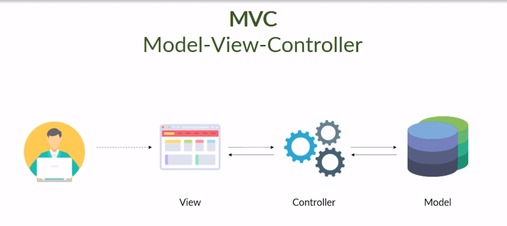

## Sumário
- [Sumário](#sumário)
- [Resumo do Projeto](#resumo-do-projeto)
- [Definição do Problema](#definição-do-problema)
- [Objetivo](#objetivo)
- [Stack Tecnológico](#stack-tecnológico)
- [Descrição da solução](#descrição-da-solução)
- [Arquitetura](#arquitetura)
- [Consolidação dos Dados Coletados](#consolidação-dos-dados-coletados)
- [Conclusões](#conclusões)
- [Limitações do Projeto e Perspectivas Futuras](#limitações-do-projeto-e-perspectivas-futuras)

## Resumo do Projeto

O projeto Roomify visa desenvolver uma aplicação web para otimizar a gestão da alocação de salas e turmas em instituições de ensino, oferecendo uma solução prática e eficiente para a administração acadêmica. A crescente complexidade no gerenciamento de horários, recursos físicos e necessidades de turmas torna o processo de alocação desafiador. Esta aplicação busca resolver essas dificuldades, ppor meio de uma ferramenta que permita o controle dinâmico do uso das salas, com funcionalidades de cadastro, consulta, edição e exclusão de dados (CRUD), além de uma interface intuitiva para visualização de cronogramas. A escolha deste projeto originou-se pela necessidade de modernização e automatização de processos administrativos em instituições de ensino, onde o uso de planilhas e métodos manuais se mostra ineficiente e propenso a erros. Com o Roomify, espera-se otimizar o uso dos espaços disponíveis, garantindo maior organização e agilidade na gestão acadêmica.

## Definição do Problema

A identificação do problema foi realizada a partir das dificuldades relatadas pela equipe de administração da unidade da faculdade SENAC, que atualmente utiliza planilhas para gerenciar a alocação de salas e turmas. A alocação de turmas em salas físicas é uma tarefa complexa e demandante no que diz respeito a administração de uma instituição de ensino. Tal processo exige a conciliação de diversos fatores, como a capacidade das salas, a distribuição dos turnos, as preferências dos professores e os requisitos específicos de cada disciplina.

## Objetivo

A aplicação Roomify busca otimizar o processo de alocação de salas em instituições de ensino, proporcionando uma plataforma eficiente e intuitiva para gerenciar horários e espaços. A aplicação visa facilitar a organização acadêmica, garantindo que as turmas sejam alocadas de maneira adequada às necessidades pedagógicas, como a capacidade das salas, os requisitos específicos de cada disciplina e as preferências dos professores. Além disso, Roomify busca minimizar conflitos de agenda por meio de uma solução web, bem como auxiliar na capacitação de usuários para uma gestão eficiente de recursos.

## Stack Tecnológico 
- Node.js
- React.js
- Next.js
- PostgresSQL
- TailwindCSS

## Descrição da solução

A solução proposta, Roomify, é uma aplicação web que oferece visibilidade total do cronograma de salas, juntamente com informações sobre suas características físicas, como capacidade, recursos disponíveis e acessibilidade. Com uma interface intuitiva, a aplicação facilita a alocação efetiva das turmas, considerando as necessidades específicas de cada disciplina.
  
O Roomify contará com telas de CRUD (Create, Read, Update e Delete) dedicadas à gestão de salas e turmas, permitindo que os administradores realizem facilmente o cadastro, consulta, edição e exclusão de dados. Além disso, a aplicação oferecerá uma tela intuitiva para visualização do cronograma, exibindo de forma clara as alocações já realizadas e as disponibilidades de cada sala. Outra funcionalidade central será a tela de alocação de turmas, onde será possível encontrar uma sala que atenta as necessidades da turma.

## Arquitetura

A arquitetura proposta é baseada no modelo MVC (Model-View-Controller), uma abordagem que organiza o desenvolvimento em três camadas distintas.

 

A camada de modelo, responsável pela lógica de dados e regras de negócio; a camada de visão, que gerencia a interface com o usuário; e a camada de controle, que atua como intermediária entre o modelo labie a visão. Essa estrutura modular facilita a manutenção e a reutilização do código, além de simplificar sua implantação.

  
## Consolidação dos Dados Coletados

O problema foi identificado a partir das dificuldades enfrentadas pela equipe administrativa da unidade SENAC, decorrentes do uso de planilhas para gerenciar a alocação de salas e turmas. Esse método manual tem se mostrado limitado e suscetível a erros, especialmente em situações que demandam uma conciliação multifatorial. As informações coletadas evidenciam a necessidade de uma solução que simplifique esse processo, proporcionando maior organização, eficiência e precisão na gestão. Esses dados fundamentam o desenvolvimento do Roomify como uma alternativa prática para superar as limitações identificadas.

## Conclusões

O desenvolvimento do Roomify apresenta uma solução inovadora e eficiente para a gestão da alocação de salas e turmas em instituições. Por meio de uma aplicação web baseada no modelo MVC, a ferramenta busca automatizar processos, minimizar erros e oferecer uma interface acessível e intuitiva. As telas de CRUD (Create, Read, Update e Delete) permitem que os usuários realizem o cadastro, a consulta, a edição e a exclusão de dados de forma rápida e intuitiva.  Ao substituir métodos manuais, como o uso de planilhas, por um sistema digital, o Roomify busca melhorar significativamente a organização acadêmica, otimizando o uso dos espaços físicos disponíveis e atendendo às necessidades dos usuários.

## Limitações do Projeto e Perspectivas Futuras

Embora o Roomify ofereça uma solução sólida para a alocação de salas, sua capacidade de atender a grandes instituições com um alto volume de dados e usuários simultâneos é limitada. A falta de otimização da infraestrutura e a ausência de mecanismos de escalabilidade podem afetar o desempenho do sistema em cenários de grande porte. Além disso, a ausência de integrações nativas com outras ferramentas acadêmicas, como sistemas de gestão de aprendizagem (SGAs) e portais do aluno, dificulta a adoção do Roomify em instituições que já possuem uma infraestrutura tecnológica consolidada. No entanto, o desenvolvimento de funcionalidades de escalabilidade, a implementação de APIs para integração com outros sistemas e a coleta de feedback dos usuários são iniciativas que visam superar essas limitações e tornar o Roomify uma solução mais completa e adaptável às necessidades das instituições de ensino.

[Back to top](#top)